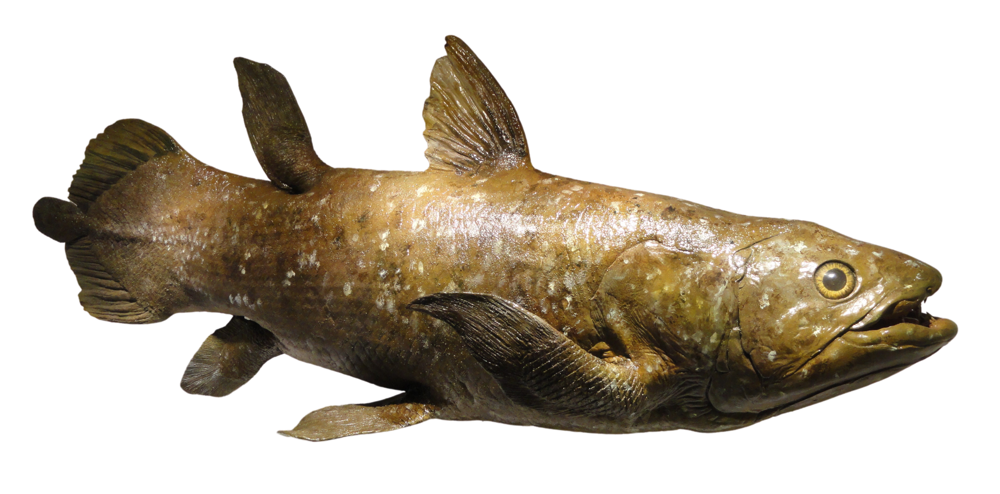
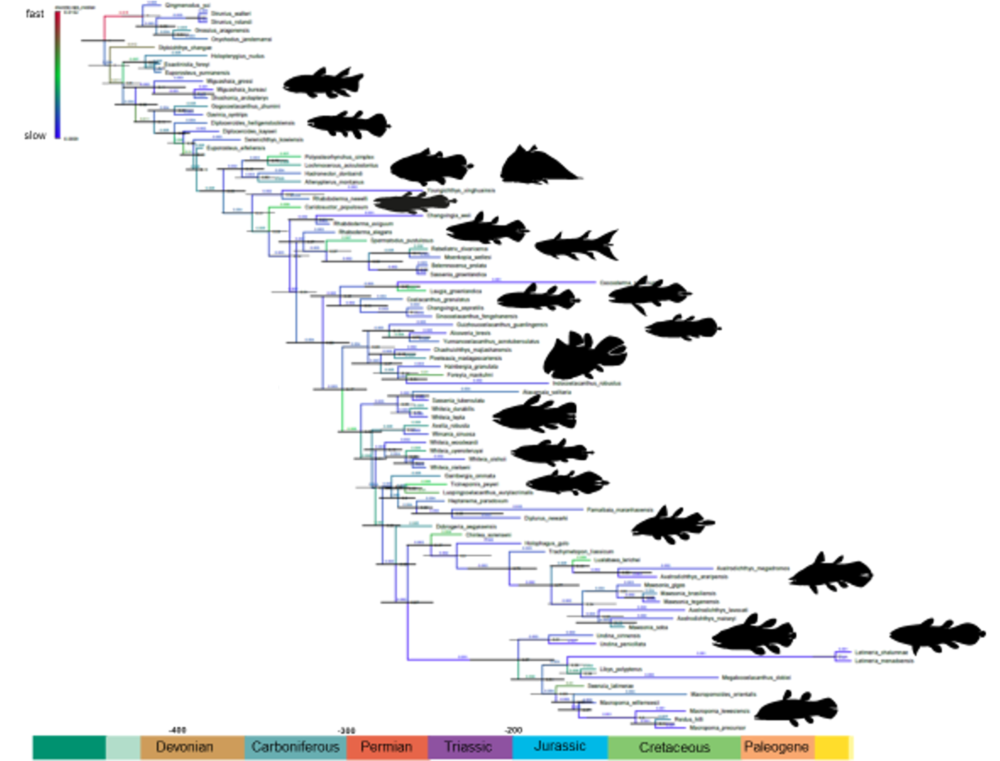
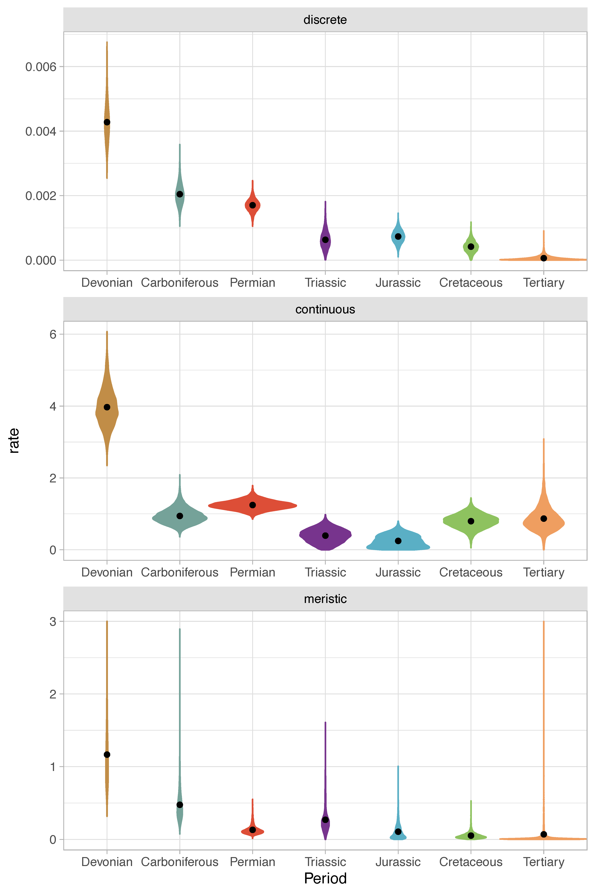
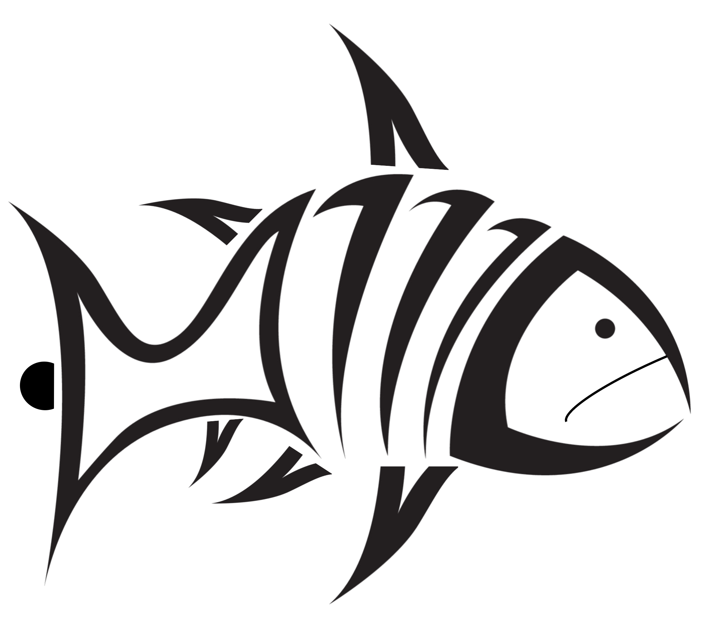
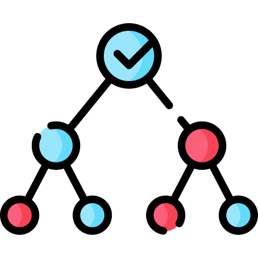

# Coelacanth evolution
Analyses accompanying article on coelacanth evolution.

 
 
Prof <a href="https://globalecologyflinders.com/people/#DIRECTOR">Corey J. A. Bradshaw</a>  
<a href="http://globalecologyflinders.com" target="_blank">Global Ecology</a> | <em><a href="https://globalecologyflinders.com/partuyarta-ngadluku-wardli-kuu/" target="_blank">Partuyarta Ngadluku Wardli Kuu</a></em>, <a href="http://flinders.edu.au" target="_blank">Flinders University</a>, Adelaide, Australia  
June 2023 
<a href=mailto:corey.bradshaw@flinders.edu.au>e-mail</a>  
 
article: 
<a href="https://www.flinders.edu.au/people/alice.clement">CLEMENT, AM</a>, <a href="https://www.uqar.ca/universite/a-propos-de-l-uqar/departements/departement-de-biologie-chimie-et-geographie/cloutier-richard">R CLOUTIER</a>, <a href="https://www.flinders.edu.au/people/mike.lee">MSY LEE</a>, <a href="https://www.benedictking.com">B KING</a>, <a href="https://scholar.google.com/citations?user=6LHmxgUAAAAJ&hl=en">O VANHAESEBROUCKE</a>, <a href="https://globalecologyflinders.com/people/#DIRECTOR">CJA BRADSHAW</a>, <a href="https://sites.google.com/site/hugodutel/home">H DUTEL</a>, <a href="https://staffportal.curtin.edu.au/staff/profile/view/kate-trinajstic-f0dcf6b1/">K TRINAJSTIC</a>, <a href="https://www.flinders.edu.au/people/john.long">JA LONG</a>. A new transitional Devonian coelacanth elucidates evolutionary dynamics in actinistians. In review
 

## Abstract 
‘Living fossils’ are colloquially characterised as modern species that have undergone little evolutionary change over extended geological time. For more than 85 years, the living coelacanth <em>Latimeria</em> (Sarcopterygii: Actinistia) has been portrayed as an iconic example of a ‘living fossil’, and one of the most morphologically conservative vertebrate groups with the slowest evolutionary rate among vertebrates. We describe a new, exceptionally well-preserved early coelacanth from the Late Devonian Gogo Formation in Western Australia (383–379 million years ago). This new fossil fish is from a critical transitional stage in coelacanth evolution and reveals new insight particularly into their branchial, neurocranial, and palaeoneurological evolution. We did the most comprehensive evolutionary analysis of the group to date, using 268 discrete, 14 meristic, and 40 continuous characters to assess the phylogeny, evolutionary rates, and the morphological disparity of coelacanths. We found a major shift in morphological disparity between Devonian and post-Devonian coelacanths. Over the last 100 million years, discrete character changes have essentially ceased, but meristic and morphometric characters have continued to evolve. Thus, coelacanths have long stopped evolving major morphological innovations, but minor tinkering of their body plan has continued.  Overall, a continuous measure of tectonic activity best explains variation in the rate of coelacanth evolution.

## <a href="https://github.com/cjabradshaw/CoelacanthEvolution/tree/main/scripts">Scripts</a>
### 1. <a href="https://github.com/cjabradshaw/CoelacanthEvolution/tree/main/scripts/BRT">phylogenetics</a>
- <code><a href="https://github.com/cjabradshaw/CoelacanthEvolution/tree/main/scripts/phylogenetics/BEAST">BEAST</a></code> (Bayesian phylogenetic analysis of discrete, meristic and continuous traits; written by <a href="https://github.com/Michael-S-Y-Lee">Mike Lee</a>)
- <code><a href="https://github.com/cjabradshaw/CoelacanthEvolution/tree/main/scripts/phylogenetics/PAUP">PAUP</a></code> (parsimony analysis of discrete traits; written by <a href="https://github.com/Michael-S-Y-Lee">Mike Lee</a>)

### 2. <a href="https://github.com/cjabradshaw/CoelacanthEvolution/tree/main/scripts/evolrate">rates of evolution</a>
- <code><a href="https://github.com/cjabradshaw/CoelacanthEvolution/blob/main/scripts/evolrate/rates_through_time.R">rates_through_time.R</a></code> (developed by <a href="https://github.com/king-ben">Ben King</a>): R code for plotting the uncorrelated log-normal (UCLN) clock rates through time requires BEAST time treefile (concatentated, post-burnin) for input.  This file contains 8000 trees and is 2 GB, and might have to be subsampled (thinned) due to memory constraints to run the script; plots in article subsampled every 5th tree. Tree file included here (<a href="https://github.com/cjabradshaw/CoelacanthEvolution/blob/main/scripts/evolrate/Coelacanths_87_268_tipsVariance_Dis_Mer_Con_uclnG_RootExp418_MC3_sumBi20%3Athinned.trees">Coelacanths_87_268_tipsVariance_Dis_Mer_Con_uclnG_RootExp418_MC3_sumBi20/thinned.trees</a>) is only the first 10 trees from this subsampled file (~ 2 MB).
- <code><a href="https://github.com/cjabradshaw/CoelacanthEvolution/blob/main/scripts/evolrate/functions.R">functions.R</a></code>: R source functions called in <code>rates_through_time.R</code>
- <code><a href="https://github.com/cjabradshaw/CoelacanthEvolution/blob/main/scripts/evolrate/epoch_clock.R">epoch_clock.R</a></code>: R code to create <em>epoch_clock</em> plot (below)

### 3. <a href="https://github.com/cjabradshaw/CoelacanthEvolution/tree/main/scripts/disparity">disparity</a>

- <code><a href="https://github.com/cjabradshaw/CoelacanthEvolution/blob/main/scripts/disparity/disparity.R">disparity.R</a></code> (developed by <a href="https://scholar.google.com/citations?user=6LHmxgUAAAAJ&hl=en">Olivia Vanhaesebroucke</a>): R code for disparity analyses and figure.

### 4. <a href="https://github.com/cjabradshaw/CoelacanthEvolution/tree/main/scripts/BRT">environmental drivers of evolution rate</a>

- <code><a href="https://github.com/cjabradshaw/CoelacanthEvolution/blob/main/scripts/BRT/Coelacanth%20evolR-envir%20model.R">Coelacanth evolR-envir model.R</a></code> (developed by <a href="https://github.com/cjabradshaw">Corey Bradshaw</a>): R code to reproduce the resampled boosted regression tree analysis for determining the environmental drivers of coelacanth rate of evolution.

## <a href="https://github.com/cjabradshaw/CoelacanthEvolution/tree/main/data">Data</a>
- <a href="https://morphobank.org/index.php">Morphobank</a> (morphological matrices) <a href="http://morphobank.org/permalink/?P3471">Project 3471</a> (project leader: <a href="https://www.flinders.edu.au/people/alice.clement">Alice Clement)</a>: project <a href="https://github.com/cjabradshaw/CoelacanthEvolution/tree/main/data/Morphobank">SSD files</a>
- <em><a href="https://github.com/cjabradshaw/CoelacanthEvolution/blob/main/data/Postcranial.TPS">Postcranial.TPS</a></em>, <em><a href="https://github.com/cjabradshaw/CoelacanthEvolution/blob/main/data/Jaws.TPS">Jaws.TPS</a></em>, <em><a href="https://github.com/cjabradshaw/CoelacanthEvolution/blob/main/data/Skull.TPS">Skull.TPS</a></em>: TPS files with landmarks coordinates for the three morphological disparity analyses with geometric morphometrics
- <em><a href="https://github.com/cjabradshaw/CoelacanthEvolution/blob/main/data/Matrix_corrected.nex">Matrix_corrected.nex</a></em>: Nexus file containing corrected matrix for morphological disparity analysis with discrete characters
- <em><a href="https://github.com/cjabradshaw/CoelacanthEvolution/blob/main/data/Age-habitat.xlsx">Age-habitat.xlsx</a></em>, <em><a href="https://github.com/cjabradshaw/CoelacanthEvolution/blob/main/data/Age-habitat-Jaw%20.xlsx">Age-habitat-Jaw.xlsx</a></em>, <em><a href="https://github.com/cjabradshaw/CoelacanthEvolution/blob/main/data/Age-habitats-GM-PC.xlsx">Age-habitat-GM-PC.xlsx</a></em>, <em><a href="https://github.com/cjabradshaw/CoelacanthEvolution/blob/main/data/Age-habitat-Skull.xlsx">Age-habitat-Skull.xlsx</a></em>: Excel files with the list of species and their ages for disparity analyses (figures)
- <em><a href="https://github.com/cjabradshaw/CoelacanthEvolution/blob/main/data/coelacanthEvolRenvDat.csv">coelacanthEvolRenvDat.csv</a></em> (compiled by <a href="https://www.uqar.ca/universite/a-propos-de-l-uqar/departements/departement-de-biologie-chimie-et-geographie/cloutier-richard">Richard Cloutier</a>): rate of evolution and environmental data (subduction flux<a href="http://doi.org/10.1016/j.gr.2021.05.016">1</a>, % shallow seas<a href="https://doi.org/10.1146/annurev-earth-081320-064052">2</a>, atmospheric [CO2]<a href="https://doi.org/10.1126/sciadv.aat4556">3</a>, sea surface temperature<a href="https://doi.org/10.1007/s12583-018-1002-2">4</a>, dissolved [O2]<a href="https://doi.org/10.1007/s12583-018-1002-2">4</a>

1<a href="http://doi.org/10.1016/j.gr.2021.05.016">Marcilly <em>et al</em></a>. 2021 <em>Gondwana Res</em> 97:176;
2<a href="https://doi.org/10.1146/annurev-earth-081320-064052">Scotese</a> 2021 <em>Ann Rev Earth Planet Sci</em> 49:679;
3<a href="https://doi.org/10.1126/sciadv.aat4556">Witkowski <em>et al</em></a>. 2018 <em>Sci Adv</em> 4:3aat4556;
4<a href="https://doi.org/10.1007/s12583-018-1002-2">Song <em>et al</em></a>. 2019 <em>J Earth Sci</em> 30:236
 

## Required <a href="https://cran.r-project.org/">R</a> libraries

<a href="https://cran.r-project.org/web/packages/cluster/index.html"><code>cluster</code></a>, <a href="https://www.rdocumentation.org/packages/data.table/versions/1.14.8"><code>data.table</code></a>, <a href="https://cran.r-project.org/web/packages/dismo/index.html"><code>dismo</code></a>, <a href="https://www.rdocumentation.org/packages/dispRity/versions/1.7.0"><code>dispRity</code></a>, <a href="https://cran.r-project.org/web/packages/dplyr/vignettes/dplyr.html"><code>dplyr</code></a>, <a href="https://www.rdocumentation.org/packages/gbm/versions/2.1.8.1"><code>gbm</code></a>, <a href="https://www.rdocumentation.org/packages/geoscale/versions/2.0/topics/geoscale-package"><code>geoscale</code></a>, <a href="https://ggplot2.tidyverse.org/"><code>ggplot2</code></a>, <a href="https://cran.r-project.org/web/packages/ggrepel/vignettes/ggrepel.html"><code>ggrepel</code></a>, <a href="https://bookdown.org/rdpeng/RProgDA/the-grid-package.html"><code>grid</code></a>, <a href="https://momx.github.io/Momocs/"><code>Momocs</code></a>, <a href="https://www.rdocumentation.org/packages/phylotate/versions/1.3"><code>phylotate</code></a>, <a href="https://www.rdocumentation.org/packages/phytools/versions/1.5-1"><code>phytools</code></a>, <a href="https://www.rdocumentation.org/packages/plyr/versions/1.8.8"><code>plyr</code></a>, <a href="https://readxl.tidyverse.org/"><code>readxl</code></a>, <a href="https://cran.r-project.org/web/packages/reshape2/index.html"><code>reshape2</code></a>, <a href="https://scales.r-lib.org/"><code>scales</code></a>, <a href="https://stat.ethz.ch/R-manual/R-devel/library/stats/html/00Index.html"><code>stats</code></a>, <a href="https://www.tidyverse.org"><code>tidyverse</code></a>, <a href="https://cran.r-project.org/web/packages/vegan/index.html"><code>vegan</code></a>
 
 
 

 &nbsp;  &nbsp; &nbsp;  &nbsp; &nbsp;  &nbsp; &nbsp;  &nbsp; &nbsp; &nbsp;  &nbsp; &nbsp; &nbsp;  &nbsp; &nbsp; &nbsp; 

